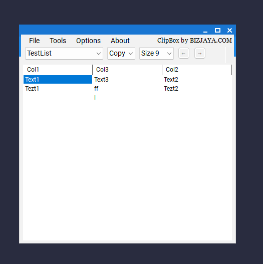

# ClipBox2



**ClipBox2** is a simple Windows Forms application for managing lists of data—often used for storing passwords or login information. It supports creating named lists (stored in `.xml` files), defining custom columns, and quickly copying or typing data into other windows.

## Features

1. **Multiple Lists**: Create and switch between multiple named lists (e.g., “Personal,” “Work,” etc.).  
2. **Custom Columns**: Define your own columns (e.g., “Username,” “Password,” “Site URL,” etc.).  
3. **DataGridView UI**: Easily edit, add, or reorder rows.  
4. **Quick Copy or “Type”**: Select a cell to copy text to the clipboard or simulate typing (using `SendKeys`).  
5. **Encryption Toggle**: Choose to encrypt the XML data or store it as plain text.

## Getting Started

### Prerequisites

- **.NET Framework 4.8** or later (on Windows).
- A compatible IDE, such as **Visual Studio** (or JetBrains Rider, VS Code with .NET plugins, etc.).

### Building & Running

1. **Clone the repository**:
    
        git clone https://github.com/bizjaya/ClipBox2.git
    
2. **Open** the `ClipBox2.sln` solution file in **Visual Studio** (or another IDE).
3. **Restore NuGet Packages** if prompted.
4. **Build** the project (`Build > Build Solution`).
5. **Run** the application (`Debug > Start Debugging` or `Ctrl+F5`).

For a self-contained build:

```
dotnet publish -c Release -r win-x64 --self-contained true -p:PublishSingleFile=true -p:IncludeNativeLibrariesForSelfExtract=true
```

### Usage

1. **Default List**: On first run, an initial `default.xml` is created automatically in the app directory.
2. **Switching Lists**: Use the **List** combo box at the top-left to select/switch to an existing XML list file.
3. **Add a New List**: Go to **File > Add List**, give the new list a name, and define any columns you need.
4. **Edit List (Columns)**: Go to **File > Edit List** to rename, reorder, add, or remove columns for the selected list.
5. **Delete List**: Go to **File > Delete List** (prompts to remove the `.xml` file).
6. **Copy vs. Type**:
    - **Copy**: Clicking a cell copies its text to the clipboard.
    - **Point**: The app momentarily loses focus and “types” the cell text into the previously active window.
7. **Editing Rows**:
    - Click the **edit button** (the small check icon) to enable editing (rows/columns reorder, add, remove).
    - Uncheck to exit edit mode and automatically save to XML.
8. **Reorder Rows**:
    - Use the **up (U)** and **down (d)** arrow buttons to move the currently selected row.

### Encryption

- By default, environment variable `encrypt` is set to `1`, so the XML data is saved in encrypted form.
- Switch between **Save as Encrypted** and **Save as Normal** in the **Options** menu.
- The environment variables `cbFol` (folder path) and `fName` (filename) direct where files are saved.

### Contributing

1. **Fork** this repository.
2. **Create** a branch for your feature or bug fix.
3. **Commit** your changes.
4. **Push** to your fork.
5. **Open** a Pull Request on GitHub.

### License

*(If you want to specify an open-source license, place it here.)*  
This project is distributed under the MIT License. See [LICENSE](LICENSE) for details.

### Acknowledgments

- Original concept built many years ago.  
- Decompiled and reconstructed from an older `.exe` with **JetBrains dotPeek**.  
- Inspired by personal need for a lightweight data manager.
